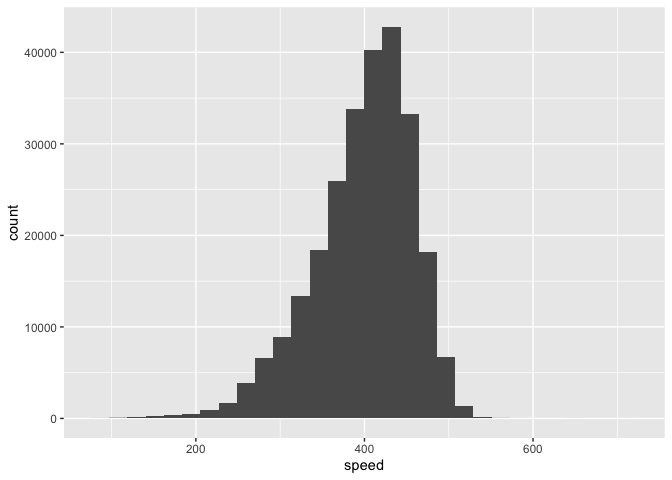

EXAM
================

R Markdown
----------

``` r
#1
#Compute the average delay by destination, then join on the airports data frame so you can show the spatial distribution of delays. Here’s an easy way to draw a map of the United States. You are welcome to use this code or some other code.

library(tidyverse)
```

    ## Warning: package 'tidyverse' was built under R version 3.5.2

    ## ── Attaching packages ───────────────── tidyverse 1.3.0 ──

    ## ✓ ggplot2 3.2.1     ✓ purrr   0.3.3
    ## ✓ tibble  2.1.3     ✓ dplyr   0.8.3
    ## ✓ tidyr   1.0.0     ✓ stringr 1.4.0
    ## ✓ readr   1.3.1     ✓ forcats 0.4.0

    ## Warning: package 'ggplot2' was built under R version 3.5.2

    ## Warning: package 'tibble' was built under R version 3.5.2

    ## Warning: package 'tidyr' was built under R version 3.5.2

    ## Warning: package 'purrr' was built under R version 3.5.2

    ## Warning: package 'dplyr' was built under R version 3.5.2

    ## Warning: package 'stringr' was built under R version 3.5.2

    ## Warning: package 'forcats' was built under R version 3.5.2

    ## ── Conflicts ──────────────────── tidyverse_conflicts() ──
    ## x dplyr::filter() masks stats::filter()
    ## x dplyr::lag()    masks stats::lag()

``` r
library(nycflights13)
```

    ## Warning: package 'nycflights13' was built under R version 3.5.2

``` r
library(lubridate)
```

    ## 
    ## Attaching package: 'lubridate'

    ## The following object is masked from 'package:base':
    ## 
    ##     date

``` r
del = flights %>% mutate(day_of_year = yday(time_hour)) %>% 
  group_by(origin, arr_delay) %>% 
  summarize(performance = mean(arr_delay, na.rm = T)) 

airports %>%
  semi_join(flights, c("faa" = "dest")) %>%
  ggplot(aes(lon, lat)) +
  borders("state") +
  geom_point() +
  coord_quickmap()
```


``` r
del = flights %>% mutate(day_of_year = yday(time_hour)) %>% 
  group_by(origin, arr_delay) %>% 
  summarize(performance = mean(arr_delay, na.rm = T)) 
```

``` r
#2

#You might expect that there’s an implicit relationship between plane and airline, because each plane is flown by a single airline. Confirm or reject this conjecture using data.
library(tidyverse)
library(nycflights13)
library(lubridate)

summary(flights)
```

    ##       year          month             day           dep_time   
    ##  Min.   :2013   Min.   : 1.000   Min.   : 1.00   Min.   :   1  
    ##  1st Qu.:2013   1st Qu.: 4.000   1st Qu.: 8.00   1st Qu.: 907  
    ##  Median :2013   Median : 7.000   Median :16.00   Median :1401  
    ##  Mean   :2013   Mean   : 6.549   Mean   :15.71   Mean   :1349  
    ##  3rd Qu.:2013   3rd Qu.:10.000   3rd Qu.:23.00   3rd Qu.:1744  
    ##  Max.   :2013   Max.   :12.000   Max.   :31.00   Max.   :2400  
    ##                                                  NA's   :8255  
    ##  sched_dep_time   dep_delay          arr_time    sched_arr_time
    ##  Min.   : 106   Min.   : -43.00   Min.   :   1   Min.   :   1  
    ##  1st Qu.: 906   1st Qu.:  -5.00   1st Qu.:1104   1st Qu.:1124  
    ##  Median :1359   Median :  -2.00   Median :1535   Median :1556  
    ##  Mean   :1344   Mean   :  12.64   Mean   :1502   Mean   :1536  
    ##  3rd Qu.:1729   3rd Qu.:  11.00   3rd Qu.:1940   3rd Qu.:1945  
    ##  Max.   :2359   Max.   :1301.00   Max.   :2400   Max.   :2359  
    ##                 NA's   :8255      NA's   :8713                 
    ##    arr_delay          carrier              flight       tailnum         
    ##  Min.   : -86.000   Length:336776      Min.   :   1   Length:336776     
    ##  1st Qu.: -17.000   Class :character   1st Qu.: 553   Class :character  
    ##  Median :  -5.000   Mode  :character   Median :1496   Mode  :character  
    ##  Mean   :   6.895                      Mean   :1972                     
    ##  3rd Qu.:  14.000                      3rd Qu.:3465                     
    ##  Max.   :1272.000                      Max.   :8500                     
    ##  NA's   :9430                                                           
    ##     origin              dest              air_time        distance   
    ##  Length:336776      Length:336776      Min.   : 20.0   Min.   :  17  
    ##  Class :character   Class :character   1st Qu.: 82.0   1st Qu.: 502  
    ##  Mode  :character   Mode  :character   Median :129.0   Median : 872  
    ##                                        Mean   :150.7   Mean   :1040  
    ##                                        3rd Qu.:192.0   3rd Qu.:1389  
    ##                                        Max.   :695.0   Max.   :4983  
    ##                                        NA's   :9430                  
    ##       hour           minute        time_hour                  
    ##  Min.   : 1.00   Min.   : 0.00   Min.   :2013-01-01 05:00:00  
    ##  1st Qu.: 9.00   1st Qu.: 8.00   1st Qu.:2013-04-04 13:00:00  
    ##  Median :13.00   Median :29.00   Median :2013-07-03 10:00:00  
    ##  Mean   :13.18   Mean   :26.23   Mean   :2013-07-03 05:22:54  
    ##  3rd Qu.:17.00   3rd Qu.:44.00   3rd Qu.:2013-10-01 07:00:00  
    ##  Max.   :23.00   Max.   :59.00   Max.   :2013-12-31 23:00:00  
    ## 

``` r
flights %>% mutate(day_of_year = yday(time_hour)) %>% 
  group_by(carrier, tailnum) %>% 
  pivot_wider(names_from=carrier, values_from = tailnum)
```

    ## # A tibble: 336,776 x 34
    ##     year month   day dep_time sched_dep_time dep_delay arr_time
    ##    <int> <int> <int>    <int>          <int>     <dbl>    <int>
    ##  1  2013     1     1      517            515         2      830
    ##  2  2013     1     1      533            529         4      850
    ##  3  2013     1     1      542            540         2      923
    ##  4  2013     1     1      544            545        -1     1004
    ##  5  2013     1     1      554            600        -6      812
    ##  6  2013     1     1      554            558        -4      740
    ##  7  2013     1     1      555            600        -5      913
    ##  8  2013     1     1      557            600        -3      709
    ##  9  2013     1     1      557            600        -3      838
    ## 10  2013     1     1      558            600        -2      753
    ## # … with 336,766 more rows, and 27 more variables: sched_arr_time <int>,
    ## #   arr_delay <dbl>, flight <int>, origin <chr>, dest <chr>,
    ## #   air_time <dbl>, distance <dbl>, hour <dbl>, minute <dbl>,
    ## #   time_hour <dttm>, day_of_year <dbl>, UA <chr>, AA <chr>, B6 <chr>,
    ## #   DL <chr>, EV <chr>, MQ <chr>, US <chr>, WN <chr>, VX <chr>, FL <chr>,
    ## #   AS <chr>, `9E` <chr>, F9 <chr>, HA <chr>, YV <chr>, OO <chr>

``` r
#By a quick glance at this data (after scrolling over to the section with all carriers) you can clearly see which planes each airline is using by tail number. Based upon this one can clearly see that similar tail numbers are used across different airlines throughout the day. So it seems as if the airlines "share" planes, i.e. do not explicitly own certain planes. 
```

``` r
#3
#Notice that flights$air_time is in minutes. Make a new column that is the air time in hours.
library(tidyverse)
library(nycflights13)
library(lubridate)

nycflights13::flights
```

    ## # A tibble: 336,776 x 19
    ##     year month   day dep_time sched_dep_time dep_delay arr_time
    ##    <int> <int> <int>    <int>          <int>     <dbl>    <int>
    ##  1  2013     1     1      517            515         2      830
    ##  2  2013     1     1      533            529         4      850
    ##  3  2013     1     1      542            540         2      923
    ##  4  2013     1     1      544            545        -1     1004
    ##  5  2013     1     1      554            600        -6      812
    ##  6  2013     1     1      554            558        -4      740
    ##  7  2013     1     1      555            600        -5      913
    ##  8  2013     1     1      557            600        -3      709
    ##  9  2013     1     1      557            600        -3      838
    ## 10  2013     1     1      558            600        -2      753
    ## # … with 336,766 more rows, and 12 more variables: sched_arr_time <int>,
    ## #   arr_delay <dbl>, carrier <chr>, flight <int>, tailnum <chr>,
    ## #   origin <chr>, dest <chr>, air_time <dbl>, distance <dbl>, hour <dbl>,
    ## #   minute <dbl>, time_hour <dttm>

``` r
flights %>% mutate(air_time = (air_time/60))
```

    ## # A tibble: 336,776 x 19
    ##     year month   day dep_time sched_dep_time dep_delay arr_time
    ##    <int> <int> <int>    <int>          <int>     <dbl>    <int>
    ##  1  2013     1     1      517            515         2      830
    ##  2  2013     1     1      533            529         4      850
    ##  3  2013     1     1      542            540         2      923
    ##  4  2013     1     1      544            545        -1     1004
    ##  5  2013     1     1      554            600        -6      812
    ##  6  2013     1     1      554            558        -4      740
    ##  7  2013     1     1      555            600        -5      913
    ##  8  2013     1     1      557            600        -3      709
    ##  9  2013     1     1      557            600        -3      838
    ## 10  2013     1     1      558            600        -2      753
    ## # … with 336,766 more rows, and 12 more variables: sched_arr_time <int>,
    ## #   arr_delay <dbl>, carrier <chr>, flight <int>, tailnum <chr>,
    ## #   origin <chr>, dest <chr>, air_time <dbl>, distance <dbl>, hour <dbl>,
    ## #   minute <dbl>, time_hour <dttm>

``` r
# Now in the flights section of the data we have air_time data shown in hours 
```

``` r
#4
#For each flight, compute the average speed of that flight (in miles per hour). Then, for each plane, compute the average of those average speeds. Display it in a histogram. You can use a base R histogram hist or ggplot’s geom_histogram.

library(tidyverse)
library(lubridate)
library(nycflights13)
nycflights13::flights
```

    ## # A tibble: 336,776 x 19
    ##     year month   day dep_time sched_dep_time dep_delay arr_time
    ##    <int> <int> <int>    <int>          <int>     <dbl>    <int>
    ##  1  2013     1     1      517            515         2      830
    ##  2  2013     1     1      533            529         4      850
    ##  3  2013     1     1      542            540         2      923
    ##  4  2013     1     1      544            545        -1     1004
    ##  5  2013     1     1      554            600        -6      812
    ##  6  2013     1     1      554            558        -4      740
    ##  7  2013     1     1      555            600        -5      913
    ##  8  2013     1     1      557            600        -3      709
    ##  9  2013     1     1      557            600        -3      838
    ## 10  2013     1     1      558            600        -2      753
    ## # … with 336,766 more rows, and 12 more variables: sched_arr_time <int>,
    ## #   arr_delay <dbl>, carrier <chr>, flight <int>, tailnum <chr>,
    ## #   origin <chr>, dest <chr>, air_time <dbl>, distance <dbl>, hour <dbl>,
    ## #   minute <dbl>, time_hour <dttm>

``` r
mutate(flights,
       gain = arr_delay - dep_delay,
       speed = distance / air_time * 60)
```

    ## # A tibble: 336,776 x 21
    ##     year month   day dep_time sched_dep_time dep_delay arr_time
    ##    <int> <int> <int>    <int>          <int>     <dbl>    <int>
    ##  1  2013     1     1      517            515         2      830
    ##  2  2013     1     1      533            529         4      850
    ##  3  2013     1     1      542            540         2      923
    ##  4  2013     1     1      544            545        -1     1004
    ##  5  2013     1     1      554            600        -6      812
    ##  6  2013     1     1      554            558        -4      740
    ##  7  2013     1     1      555            600        -5      913
    ##  8  2013     1     1      557            600        -3      709
    ##  9  2013     1     1      557            600        -3      838
    ## 10  2013     1     1      558            600        -2      753
    ## # … with 336,766 more rows, and 14 more variables: sched_arr_time <int>,
    ## #   arr_delay <dbl>, carrier <chr>, flight <int>, tailnum <chr>,
    ## #   origin <chr>, dest <chr>, air_time <dbl>, distance <dbl>, hour <dbl>,
    ## #   minute <dbl>, time_hour <dttm>, gain <dbl>, speed <dbl>

``` r
nycflights13::flights
```

    ## # A tibble: 336,776 x 19
    ##     year month   day dep_time sched_dep_time dep_delay arr_time
    ##    <int> <int> <int>    <int>          <int>     <dbl>    <int>
    ##  1  2013     1     1      517            515         2      830
    ##  2  2013     1     1      533            529         4      850
    ##  3  2013     1     1      542            540         2      923
    ##  4  2013     1     1      544            545        -1     1004
    ##  5  2013     1     1      554            600        -6      812
    ##  6  2013     1     1      554            558        -4      740
    ##  7  2013     1     1      555            600        -5      913
    ##  8  2013     1     1      557            600        -3      709
    ##  9  2013     1     1      557            600        -3      838
    ## 10  2013     1     1      558            600        -2      753
    ## # … with 336,766 more rows, and 12 more variables: sched_arr_time <int>,
    ## #   arr_delay <dbl>, carrier <chr>, flight <int>, tailnum <chr>,
    ## #   origin <chr>, dest <chr>, air_time <dbl>, distance <dbl>, hour <dbl>,
    ## #   minute <dbl>, time_hour <dttm>

``` r
flights %>% 
  mutate(speed = distance / air_time * 60)  %>% 
  group_by(tailnum, speed) %>%
  summarize(msped=mean(speed, na.rm=T)) %>%
  ggplot()+geom_histogram(aes(x = speed))
```

    ## `stat_bin()` using `bins = 30`. Pick better value with `binwidth`.

    ## Warning: Removed 1855 rows containing non-finite values (stat_bin).



``` r
#5 

#To examine if there is anything in the plane data that correlates with average speed, use geom_boxplot with average speed of the plane (in previous question) on the y-axis and planes$engine on the x-axis. Do the same for planes$engines and planes$type.
library(ggplot2)
library(lubridate)
library(nycflights13)
library(tidyverse)
nycflights13::flights
```

    ## # A tibble: 336,776 x 19
    ##     year month   day dep_time sched_dep_time dep_delay arr_time
    ##    <int> <int> <int>    <int>          <int>     <dbl>    <int>
    ##  1  2013     1     1      517            515         2      830
    ##  2  2013     1     1      533            529         4      850
    ##  3  2013     1     1      542            540         2      923
    ##  4  2013     1     1      544            545        -1     1004
    ##  5  2013     1     1      554            600        -6      812
    ##  6  2013     1     1      554            558        -4      740
    ##  7  2013     1     1      555            600        -5      913
    ##  8  2013     1     1      557            600        -3      709
    ##  9  2013     1     1      557            600        -3      838
    ## 10  2013     1     1      558            600        -2      753
    ## # … with 336,766 more rows, and 12 more variables: sched_arr_time <int>,
    ## #   arr_delay <dbl>, carrier <chr>, flight <int>, tailnum <chr>,
    ## #   origin <chr>, dest <chr>, air_time <dbl>, distance <dbl>, hour <dbl>,
    ## #   minute <dbl>, time_hour <dttm>

``` r
mutate(flights,
       speed = distance / air_time * 60) 
```

    ## # A tibble: 336,776 x 20
    ##     year month   day dep_time sched_dep_time dep_delay arr_time
    ##    <int> <int> <int>    <int>          <int>     <dbl>    <int>
    ##  1  2013     1     1      517            515         2      830
    ##  2  2013     1     1      533            529         4      850
    ##  3  2013     1     1      542            540         2      923
    ##  4  2013     1     1      544            545        -1     1004
    ##  5  2013     1     1      554            600        -6      812
    ##  6  2013     1     1      554            558        -4      740
    ##  7  2013     1     1      555            600        -5      913
    ##  8  2013     1     1      557            600        -3      709
    ##  9  2013     1     1      557            600        -3      838
    ## 10  2013     1     1      558            600        -2      753
    ## # … with 336,766 more rows, and 13 more variables: sched_arr_time <int>,
    ## #   arr_delay <dbl>, carrier <chr>, flight <int>, tailnum <chr>,
    ## #   origin <chr>, dest <chr>, air_time <dbl>, distance <dbl>, hour <dbl>,
    ## #   minute <dbl>, time_hour <dttm>, speed <dbl>

``` r
#flights %>% 
#  mutate(speed = distance / air_time * 60)  %>% 
#  group_by(tailnum, speed) %>%
#  summarize(msped=mean(speed, na.rm=T)) %>%
#  ggplot()+geom_boxplot(aes(x = planes$engine, y= speed, col = origin))


#flights %>% 
#  mutate(speed = distance / air_time * 60)  %>% 
#  group_by(tailnum, speed) %>%
#  summarize(msped=mean(speed, na.rm=T)) %>%
#  ggplot()+geom_boxplot(aes(x = planes$engines, y= speed, col = origin))

#(flights %>% 
 # mutate(speed = distance / air_time * 60)  %>% 
  #group_by(tailnum, speed) %>%
 # summarize(msped=mean(speed, na.rm=T)) %>%
 # ggplot()+geom_boxplot(aes(x = planes$type, y= speed, col = origin))


# plots for all three required with corresponding boxplots , had issue with aesthetics didnt have time to fix in exam but here is code with # so it knits 
```

\`\`\`
